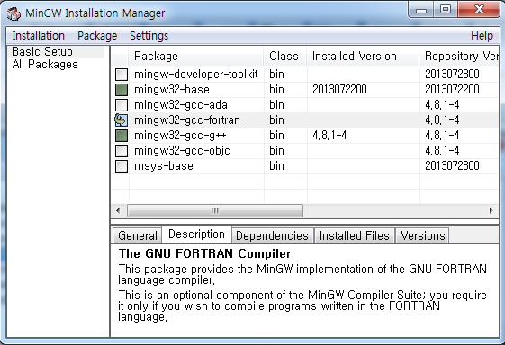
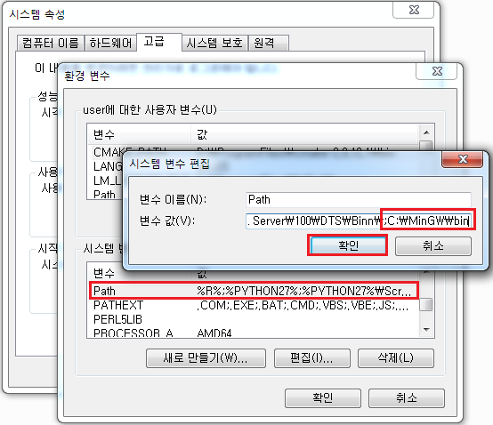
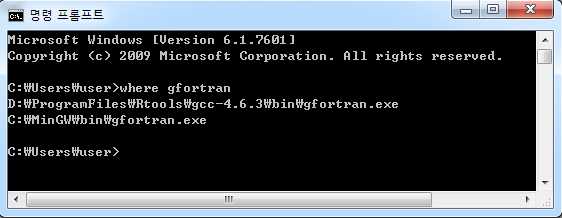
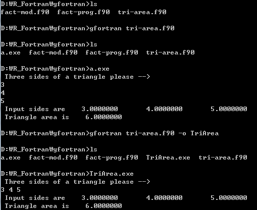
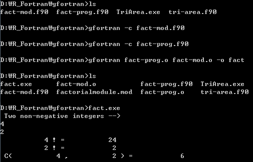
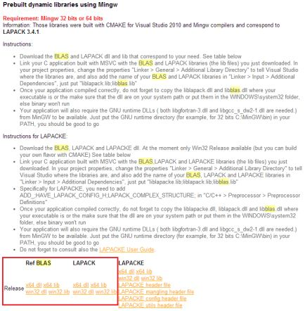
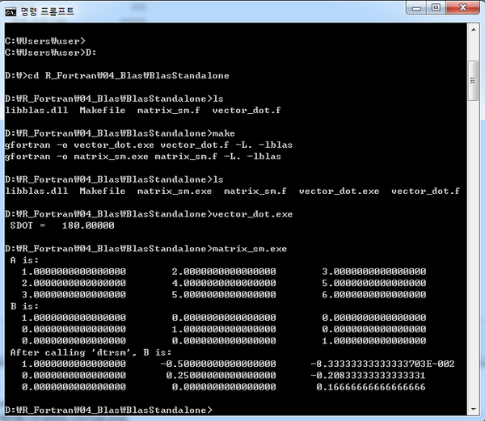
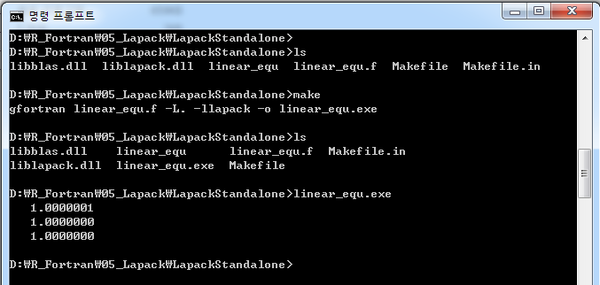

R Extension Test Note for Windows
========================================================
Weicheng Zhu

2013.12.06

# Fortran Compiler and Usage

## `MinGW` Installation

> A contraction of "Minimalist GNU for Windows", is a minimalist development environment for native Microsoft Windows applications.

- `MinGW`: http://www.mingw.org/

  - Provides a complete Open Source programming tool set which is suitable for the development of native MS-Windows applications, and which do not depend on any 3rd-party C-Runtime DLLs.
  - A port of the GNU Compiler Collection (GCC), including C, C++, ADA and Fortran compilers;
  - ...
- Download: http://sourceforge.net/projects/mingw/files/latest/download?source=files
- Install: check to install Fortran GNU Compiler



- Set System PATH



- Confirm: in windows CMD command line, `where` is the equivalent of `which` in Linux.
As shown in the following figure, there are two `gfortran` executable file in my system path, the first one will be used by default.



## `gfortran` Usage

- The GNU Fortran Compiler: http://gcc.gnu.org/onlinedocs/gfortran/
- Getting started with gfortran: http://gcc.gnu.org/wiki/GFortranGettingStarted
- Example1
  - Compile one file. This program is used to calculate the area of a triangle given side lengths.
  - Source location: `gfortran/tri-area.f90`, from: http://www.cs.mtu.edu/~shene/COURSES/cs201/NOTES/chap06/area-2.html

<div class="chunk" id="unnamed-chunk-1"><div class="rcode"><div class="source"><pre class="knitr r">## The simplest way, default output is `a.exe`
gfortran tri-area.f90
## -o: specify the output name
gfortran tri-area.f90 -o TriArea
</pre></div>
</div></div>




- Example2
  - Compile two files, one of which defines a module. This program is used to calculate the factorial $n!$ and combinatorial coefficient $C^r_n$ given $n$ and $r$.
  - Source location: `gfortran/fact-mod.f90`, `gfortran/fact-prog.f90`, from http://www.cs.mtu.edu/~shene/COURSES/cs201/NOTES/chap06/fact-2.html

```r
## 1. Straight forward
gfortran fact-prog.f90 fact-mod.f90 -o fact
## 2. Step by step
gfortran -c fact-mod.f90
gfortran -c fact-prog.f90
gfortran fact-prog.o fact-prog.o -o fact
```



**Note1:** In the *step by step* method, a `factorialmodule.mod` file is generated together with the `fact-mod.o` file. The former file is associated with the latter one, so if you delete the mod file, the last step will fail.

**Note2:** If you want to be an advanced developer, you should learn how to use command line and avoid using IDE if possible.

**Note3:** There are also some other popular Fortran compilers in Windows, such as `Absoft Pro Fortran` and `Intel Fortran Compiler`, which are all proprietary software. Since `R` uses `gcc` to build package and R itself in Windows, we only introduce `gfortran` compiler here.


# BLAS & LAPACK & ATLAS
## BLAS (Basic Linear Algebra Subprograms)
> The Basic Linear Algebra Subprograms (BLAS) define a set of fundamental operations on vectors and matrices which can be used to create optimized higher-level linear algebra functionality.

- There are three levels of BLAS operations,
  - The Level 1 BLAS perform scalar, vector and vector-vector operations;
  - The Level 2 BLAS perform matrix-vector operations;
  - The Level 3 BLAS perform matrix-matrix operations.
  
- Quick Reference Guide to the BLAS: http://www.netlib.org/lapack/lug/node145.html
- Reference Card: http://www.netlib.org/blas/blasqr.pdf
- Homepage: http://www.netlib.org/blas/
- Installation for Windows: http://icl.cs.utk.edu/lapack-for-windows/lapack/

**Note:** In this manual, we use the 'Prebuilt libraries'(check the 'Prebuilt dynamic libraries using Mingw' section described in Installation for Windows' above). Download the 32-bit dll files for both BLAS and LAPACK: `libblas.dll` and `liblapack.dll`. Of course, you can also build BLAS and LAPACK manually by yourself.



- Examples: vector-vector calculation $x^Tx$; matrix-matrix calculation $A^{-1}B$
  - Source location: `gfortran/BlasStandalone/vector_dot.f` and `gfortran/BlasStandalone/matrix_sm.f`
  - Usage: Copy the downloaded `libblas.dll` to the `BlasStandalone` folder. Then, in the CMD command line, input `make` and enter, two executable files `matrix_sm.exe` and `vector_dot.exe` will be generated. Or you can input directly in the command line `gfortran -o xxx.exe xxx.f -L. -lblas`, where the `-L. -lblas` option means linking the `libblas.dll` file in the current directory to the program.
  - Reference: `sdot`: http://www.netlib.org/blas/sdot.f; `dtrsm`: http://www.netlib.org/blas/dtrsm.f
  
**Note:** The `gfortran` compiler installed by Rtools lacks of some component for compiling standalone fortran program with BLAS and LAPACK, so you need to install `MinGW` first.

```fortran
c vector_dot.f
c Example. Using BLAS Level 1 Routine
c vector-vector dot product
c Compute (1, 3, 5, 7, 9) * (10, 9, 8, 7, 6)
      program dot_main
      real x(10), y(10), sdot, res
      integer n, incx, incy, i
      n=5
      incx=2
      incy=1
      do i = 1, 10
         x(i) = i
         y(i) = 11-i
      end do
      res = sdot(n, x, incx, y, incy)
      print*,'SDOT =', res
      end
```


```fortran
c matrix_sm.f
c Example. Using BLAS Level 3 Routine
c matrix-matrix solve, solve(A)%*%B, where A is mxm, B is mxn
c         [1, 2, 3]      [1, 4]
c    A =  [2, 4, 5], B = [2, 5]
c         [3, 5, 6]      [3, 6]
c Function: 
c    DTRSM (SIDE, UPLO, TRANSA, DIAG, M, N, ALPHA, A, LDA, B, LDB)
      program dot_main
      double precision a(3,3), b(3,2), alpha
      integer i, j, m, n, lda, ldb
      character side, uplo, transa, diag
      side='l'
      uplo='u'
      transa='n'
      diag='n'
      data A/1.0, 2.0, 3.0, 2.0, 4.0, 5.0, 3.0, 5.0, 6.0/
      data B/1.0, 2.0, 3.0, 4.0, 5.0, 6.0/
      alpha=1.0
      m=3
      n=2
      lda=3
      ldb=3
      write(*,*) "A is:"
      do i=1, m
         print*, (A(i,j), j=1,m)
      enddo

      write(*,*) "B is:"
      do i=1, m
         print*, (B(i,j), j=1,n)
      enddo
      call dtrsm(side, uplo, transa, diag, m, n, alpha, a, lda, b, ldb)

      write(*,*) "After calling 'dtrsm', B is:"
      do i=1, m
         print*, (B(i,j), j=1,n)
      enddo
      end
```



## LAPACK (Linear Algebra PACKage)
> LAPACK is written in Fortran 90 and provides routines for solving systems of simultaneous linear equations, least-squares solutions of linear systems of equations, eigenvalue problems, and singular value problems. The associated matrix factorizations (LU, Cholesky, QR, SVD, Schur, generalized Schur) are also provided, as are related computations such as reordering of the Schur factorizations and estimating condition numbers. Dense and banded matrices are handled, but not general sparse matrices. In all areas, similar functionality is provided for real and complex matrices, in both single and double precision.

- Homepage: http://www.netlib.org/lapack/
- Users' Guide: http://www.netlib.org/lapack/#_users_guide
- Routines: http://www.netlib.org/lapack/individualroutines.html
- Examples: http://www.physics.orst.edu/~rubin/nacphy/lapack/fortran.html
- Installation for Windows: http://icl.cs.utk.edu/lapack-for-windows/lapack/

**Note:** Check the *Note* information in BLAS section.

- Examples: Solving $Ax=B$
- Source location: `gfortran/LapackStandalone/linear_equ.f`
- Usage: Copy the downloaded `libblas.dll` and `liblapack.dll` to the `R_Fortran/05_Lapack/LapackStandalone` folder. In the CMD command line input `make` or directly input `gfortran linear_equ.f -L. -llapack -o linear_equ.exe` in the command line. The `-L. -llapack` option means link the `liblapack.dll` file in the current directory to the program. `liblapack.dll` depends on `libblas.dll`, so `libblas.dll` is also necessary.
- Reference: `SGESV`: http://www.netlib.org/lapack/single/sgesv.f

```fortran
c     linear_equ.f
c     Example of solving linear equations
c     solving the matrix equation A*x=b using LAPACK
c     From: http://www.physics.orst.edu/~rubin/nacphy/lapack/codes/linear-f.html
      Program LinearEquations
      Implicit none
c     declarations, notice single precision
      Real*4 A(3,3), b(3)
      integer i, j, pivot(3), ok
c     define matrix A
      data A/3.1, 1.0, 3.4, 1.3, -6.9, 7.2, -5.7, 5.8, -8.8/
c     define vector b, make b a matrix and you can solve multiple
c     equations with the same A but different b
      data b/-1.3, -0.1, 1.8/
c     find the solution using the LAPACK routine SGESV
      call SGESV(3, 1, A, 3, pivot, b, 3, ok)
c     parameters in the order as they appear in the function call
c     order of matrix A, number of right hand sides (b), matrix A,
c     leading dimension of A, array that records pivoting, 
c     result vector b on entry, x on exit, leading dimension of b
c     return value 
c     
c     print the vector x
      do i=1, 3
         write(*,*) b(i)
      end do
      end
```



## ATLAS (Automatically Tuned Linear Algebra Software)

> ATLAS stands for Automatically Tuned Linear Algebra Software. ATLAS is both a research project and a software package. ATLAS's purpose is to provide portably optimal linear algebra software. The current version provides a complete BLAS API (for both C and Fortran77), and a very small subset of the LAPACK API. For all supported operations, ATLAS achieves performance on par with machine-specific tuned libraries.

- Homepage: http://math-atlas.sourceforge.net/
- Use ATLAS in R
  1. Download the `Rblas.dll` file frome http://cran.r-project.org/bin/windows/contrib/ATLAS/
  2. Replace the `Rblas.dll` file in the `R-x.x.x\bin\x32` directory.

# R foreign language interfaces

**When to use?**
When a task requires explicit loops that can't be vectorized away. If a task can be vectorized or has no more than one loop, using R only would be a better choice, since in such situation, converting R code to C or Fortran doesn't improve much implementation efficient. 

**Tools?**
In linux system, if R has been installed, the developing environment is already prepared. In MS Windows system, after installing R, you also need to install the `Rtools`.

## `Rtools`
> The standard toolchain for building R packages under Microsoft Windows, or for building R itself. It contains the command line tools, MinGW compilers, etc.

- Download: http://cran.r-project.org/bin/windows/Rtools/
- Install
- Add `path\to\Rtools\bin;path\to\Rtools\gcc-x.x.x\bin;` to the system `PATH` variable
- For more details, read the `Rtools.txt` and `README.txt` file in the main Rtools directory.


## R and Fortran Interface
### .Fortran interface
#### General procedure

1. Writting Fortran subroutines, say `xxx(arg1, arg2)`, and saving it in the `foo.f` file.
2. Compling Fortran code to Dynamic Link Library or shared objects(`.dll`/`.so`) with `R CMD SHLIB foo.f` command.
3. In R, loading `foo.dll`/`foo.so` to R with `dyn.load('foo.dll')`
4. In R, calling subroutines defined in `foo.f` with `.Fortran` function: `.Fortran('xxx', arg1, arg2)`

#### Notice
- The Fortran code to be called **MUST** be a subroutines.
- Lengths of the vectors passed to Fortran subroutine should be given.
- When invoking `.Fortran` function, argument types should be matched by explicit coersions with `as.integer` or `as.double` or by creating vectors of an explicit storage mode and length using the constructors `integer(n)` and `double(n)`.
- The return value from `.Fortran` is a list with the same number of components (and names, if given) as the argument list.

**Comparison of R and Fortran data types**

R storage mode | FORTRAN type
---------------|-------------
logical  |  INTEGER
integer	|	INTEGER
double	|	DOUBLE PRECISION
complex	|	DOUBLE COMPLEX
character	|	CHARACTER*255
raw	unsigned |	none


#### Example1: convolve
This is the canonical example introduced in Writting R Extensions.

The convolution of two sequences $x_1, ..., x_n$ and $y_1, ...y_m$ is defined as: $z_k = \sum_{i+j=k}x_iy_j$

**The Fortran part**

```fortran
c A subroutine to convole two finite sequences
      subroutine convolvef(a, na, b, nb, ab)
      integer na, nb, nab, i, j
      double precision a(na), b(nb), ab(na+nb-1)
      nab = na + nb - 1
      
      do 10 i = 1, nab
         ab(i) = 0.0
 10   continue
      do 20 i = 1, na
         do 30 j = 1, nb
            ab(i+j-1) = ab(i+j) + a(i)*b(j)
 30      continue
 20   continue
      end
```

**The R part**

<div class="chunk" id="01_convolve"><div class="rcode"><div class="source"><pre class="knitr r"># Load Shared Objects (*.so) / Dynamic-Link Library (*.DLL)
# dyn.load("01_convolve/convolve.so")     # Linux
# dyn.load("01_convolve/convolve.dll")  # Windows
dyn.load(file.path("R_Fortran", "01_Convolve", paste0("convolve", .Platform$dynlib.ext)))  # Platform independence
# Check whether Fortran subroutine `convolvef` is available
is.loaded("convolvef")
</pre></div>
<div class="output"><pre class="knitr r">## [1] TRUE
</pre></div>
<div class="source"><pre class="knitr r">
x=1:5
y=6:10
# 
.Fortran("convolvef", as.double(x), as.integer(length(x)), as.double(y), as.integer(length(y)),
         double(length(x) + length(y) - 1))
</pre></div>
<div class="output"><pre class="knitr r">## [[1]]
## [1] 1 2 3 4 5
## 
## [[2]]
## [1] 5
## 
## [[3]]
## [1]  6  7  8  9 10
## 
## [[4]]
## [1] 5
## 
## [[5]]
## [1]   6  19  40  70 110 114 106  85  50
</pre></div>
<div class="source"><pre class="knitr r">.Fortran("convolvef", as.double(x), as.integer(length(x)), as.double(y), as.integer(length(y)),
         xy = double(length(x) + length(y) - 1))$xy
</pre></div>
<div class="output"><pre class="knitr r">## [1]   6  19  40  70 110 114 106  85  50
</pre></div>
<div class="source"><pre class="knitr r">
# R wrapper
conv_f <- function(x, y){
    if(!(is.numeric(x) && is.numeric(y)))
        stop("x and y should be both numeric vector")
    .Fortran("convolvef", as.double(x), as.integer(length(x)), as.double(y), as.integer(length(y)),
                  double(length(x) + length(y) - 1))
}

conv_f(1:5, 6:10)
</pre></div>
<div class="output"><pre class="knitr r">## [[1]]
## [1] 1 2 3 4 5
## 
## [[2]]
## [1] 5
## 
## [[3]]
## [1]  6  7  8  9 10
## 
## [[4]]
## [1] 5
## 
## [[5]]
## [1]   6  19  40  70 110 114 106  85  50
</pre></div>
<div class="source"><pre class="knitr r">conv_f(1:5, 6:7)
</pre></div>
<div class="output"><pre class="knitr r">## [[1]]
## [1] 1 2 3 4 5
## 
## [[2]]
## [1] 5
## 
## [[3]]
## [1] 6 7
## 
## [[4]]
## [1] 2
## 
## [[5]]
## [1]  6 19 32 45 58 35
</pre></div>
<div class="source"><pre class="knitr r">dyn.unload(file.path("R_Fortran", "01_Convolve", paste0("convolve", .Platform$dynlib.ext)))  # Platform independence
</pre></div>
</div></div>


#### Example2: swap & Reverse
We'll study more details about the `.Fortran` interface though this example.

**The Fortran part**

```fortran
c     swap two integer number
      subroutine ISWAPF (a, b)
      integer a, b, tmp
      tmp = a
      a = b
      b = tmp
      end

c     swap two double number
      subroutine DSWAPF (a, b)
      double precision a, b, tmp
      tmp = a
      a = b
      b = tmp
      end

c     Subroutine Reverse:
c     reverses the order of the input array
      subroutine Reversef(a, n)
      integer n, i
      double precision a(n)
      do 10 i = 1, INT(n/2)
         call DSWAPF(a(i), a(n - i + 1))
 10   continue
      end
```

**The R part**

<div class="chunk" id="02_swap"><div class="rcode"><div class="source"><pre class="knitr r"># ?.Fortran
# All Fortran compilers known to be usable to compile R map
# symbol names to lower case.  Symbol names containing underscores are
# not valid Fortran 77 (although they are valid in Fortran
# 9x). Portable code should not use Fortran names containing underscores.
# `gfortran` transforms names of entities specified in the Fortran source file by appending underscores to them.
dyn.load(file.path("R_Fortran", "02_Swap", paste0("swap", .Platform$dynlib.ext)))
is.loaded("iswapf")
</pre></div>
<div class="output"><pre class="knitr r">## [1] TRUE
</pre></div>
<div class="source"><pre class="knitr r">
x=10
y=20
# a and b are a copy of x and y, x and y doesn't change
# a and b are called by reference
.Fortran("iswapf", a=as.integer(x), b=as.integer(y))
</pre></div>
<div class="output"><pre class="knitr r">## $a
## [1] 20
## 
## $b
## [1] 10
</pre></div>
<div class="source"><pre class="knitr r">x; y
</pre></div>
<div class="output"><pre class="knitr r">## [1] 20
</pre></div>
<div class="source"><pre class="knitr r"># The arguments are not meaningful
.Fortran("iswapf", p=as.integer(x), q=as.integer(y))
</pre></div>
<div class="output"><pre class="knitr r">## $p
## [1] 20
## 
## $q
## [1] 10
</pre></div>
<div class="source"><pre class="knitr r"># With 'DUP = FALSE', your compiled code can alter the local variable
# DEP=FALSE can speed up the program by avoiding pssing hudge matrix
# Oops..., didn't swap! Why?
.Fortran("iswapf", as.integer(x), as.integer(y), DUP=FALSE)
</pre></div>
<div class="output"><pre class="knitr r">## [[1]]
## [1] 20
## 
## [[2]]
## [1] 10
</pre></div>
<div class="source"><pre class="knitr r">x; y
</pre></div>
<div class="output"><pre class="knitr r">## [1] 20
</pre></div>
<div class="source"><pre class="knitr r"># Use `dswapf`. Wow!
.Fortran("dswapf", as.double(x), as.double(y), DUP=FALSE)
</pre></div>
<div class="output"><pre class="knitr r">## [[1]]
## [1] 20
## 
## [[2]]
## [1] 10
</pre></div>
<div class="source"><pre class="knitr r">x; y
</pre></div>
<div class="output"><pre class="knitr r">## [1] 10
</pre></div>
<div class="source"><pre class="knitr r"># Mhm...
is.double(x)
</pre></div>
<div class="output"><pre class="knitr r">## [1] TRUE
</pre></div>
<div class="source"><pre class="knitr r">x=as.integer(10)
y=as.integer(20)
.Fortran("iswapf", x, y, DUP=FALSE)
</pre></div>
<div class="output"><pre class="knitr r">## [[1]]
## [1] 20
## 
## [[2]]
## [1] 10
</pre></div>
<div class="source"><pre class="knitr r">x; y
</pre></div>
<div class="output"><pre class="knitr r">## [1] 10
</pre></div>
<div class="source"><pre class="knitr r">
# Reverse a vector
# x, y are vectors of lenth n, exchange x[i] and y[i] if x[i] is bigger than y[i], i=1,...,n
# ivswapf subroutine invokes the iswapf subroutine
# Again, what's the problem here?
x=1:10
if(is.loaded("reversef"))
    .Fortran("reversef", as.double(x), as.integer(length(x)), DUP=FALSE)
</pre></div>
<div class="output"><pre class="knitr r">## [[1]]
##  [1] 10  9  8  7  6  5  4  3  2  1
## 
## [[2]]
## [1] 10
</pre></div>
<div class="source"><pre class="knitr r"># So, always be careful about the dat type
is.integer(x)
</pre></div>
<div class="output"><pre class="knitr r">## [1] TRUE
</pre></div>
<div class="source"><pre class="knitr r">x=as.double(1:10)
if(is.loaded("reversef"))
    .Fortran("reversef", x, as.integer(length(x)), DUP=FALSE)
</pre></div>
<div class="output"><pre class="knitr r">## [[1]]
##  [1] 10  9  8  7  6  5  4  3  2  1
## 
## [[2]]
## [1] 10
</pre></div>
<div class="source"><pre class="knitr r">x
</pre></div>
<div class="output"><pre class="knitr r">##  [1] 10  9  8  7  6  5  4  3  2  1
</pre></div>
<div class="source"><pre class="knitr r">dyn.unload(file.path("R_Fortran", "02_Swap", paste0("swap", .Platform$dynlib.ext)))
</pre></div>
</div></div>


**Concepts & Conclusions**
- `symbol name` vs `transformed symbol name`
- the arguments are a copy of the passed variables
- the arguments are 'meaningless'
- passing the R variables' real address via `DUP=FALSE`
- do coerce the data type before passing to Fortran

#### Example3: array
An example of using Fortran90 to calculate the summation and multiplication of matrix.

**Intrinsic functions in Fortran 90:** http://www.nsc.liu.se/~boein/f77to90/a5.html

**The Fortran part**

```fortran
! subroutine of matrix summation with fortran90
subroutine arraysumf90(a, b, c, nrow, ncol)
  implicit none
  integer nrow, ncol, i, j
  double precision a(nrow, ncol), b(nrow, ncol), c(nrow, ncol)
  c = a + b
end subroutine arraysumf90

! subroutine of matrix inner product with fortran90
subroutine arraymulf90(a, b, c, nrow, ncol)
  implicit none
  integer nrow, ncol, i, j
  double precision a(nrow, ncol), b(nrow, ncol), c(nrow, ncol)
  c = matmul(a, b)
end subroutine arraymulf90
```

**The R part**

<div class="chunk" id="03_array_90"><div class="rcode"><div class="source"><pre class="knitr r"># Fortran90
x=y=z=matrix(1:9, 3)
dyn.load(file.path("R_Fortran", "03_Array", paste0("array90", .Platform$dynlib.ext)))
# matrix summation
is.loaded("arraysumf90")
</pre></div>
<div class="output"><pre class="knitr r">## [1] TRUE
</pre></div>
<div class="source"><pre class="knitr r">.Fortran("arraysumf90", as.double(x), as.double(y), as.double(z), as.integer(nrow(x)), as.integer(ncol(x)))[[3]]
</pre></div>
<div class="output"><pre class="knitr r">## [1]  2  4  6  8 10 12 14 16 18
</pre></div>
<div class="source"><pre class="knitr r"># matrix multiplication
is.loaded("arraymulf90")
</pre></div>
<div class="output"><pre class="knitr r">## [1] TRUE
</pre></div>
<div class="source"><pre class="knitr r">.Fortran("arraymulf90", as.double(x), as.double(y), as.double(z), as.integer(nrow(x)), as.integer(ncol(x)))[[3]]
</pre></div>
<div class="output"><pre class="knitr r">## [1]  30  36  42  66  81  96 102 126 150
</pre></div>
<div class="source"><pre class="knitr r">x%*%y
</pre></div>
<div class="output"><pre class="knitr r">##      [,1] [,2] [,3]
## [1,]   30   66  102
## [2,]   36   81  126
## [3,]   42   96  150
</pre></div>
<div class="source"><pre class="knitr r">dyn.unload(file.path("R_Fortran", "03_Array", paste0("array90", .Platform$dynlib.ext)))
</pre></div>
</div></div>


#### Example4: BLAS
**Working principle**
R uses the BLAS and LAPACK libraries to do basic linear algebra calculations, and the BLAS and LAPACK is used via Dynamic Link Library. On Windows, these DLL files, named `Rblas.dll` and `Rlapack.dll`, maybe exist in the `bin` folder under R home directory, such as `R-x.xx/bin/x64`.

Fortran can use R's BLAS and Lapack library directly by linking to the DLLs, so you don't need to install BLAS and Lapack seperately on your system. To link your Fortran code to the DLLs, you need to use the `-lblas` and `-llapack` option whlie compiling your code to DLLs. Usually it would be convenient to write a `Makevars` file with the content:

```
PKG_LIBS = $(LAPACK_LIBS) $(BLAS_LIBS)
```

Then when you run the `R CMD SHLIB` command, R can link your code to BLAS and Lapack properly.

---------------------------------

In this example, we'll make a fortran subroutine called `idamaxf` by using the [`IDAMAX`](http://www.netlib.org/blas/idamax.f) function in BLAS library to calculate the first occurrence of the maximum absolute value of a double precision vector. Then compile it to DLL and invoke it in R.

**The Fortran part**

```fortran
c     IDAMAX searches a double precision vector for the first occurrence
c     of the the maximum absolute value.
c     Arguments:
c       n: Number of elements to process in the vector to be searched.
c       x: Array of dimension (n-1) * |incx| + 1.
c       incx: Increment between elements of x.
      subroutine idamaxf(n, x, incx, y)
      integer n, incx, y, idamax
      double precision x(*)
      y = idamax(n, x, incx)
      return
      end
```

**The R part**

<div class="chunk" id="04_Blas"><div class="rcode"><div class="source"><pre class="knitr r">dyn.load(file.path("R_Fortran", "04_Blas", paste0("blas_idamax", .Platform$dynlib.ext)))
# Test
is.loaded("idamaxf")
</pre></div>
<div class="output"><pre class="knitr r">## [1] TRUE
</pre></div>
<div class="source"><pre class="knitr r">n = 10
# PROBLEM: when incx < 0, return value is always 0!
incx = 1
x = sample((n-1)*abs(incx) + 1)
x
</pre></div>
<div class="output"><pre class="knitr r">##  [1]  4  7 10  1  8  5  3  6  2  9
</pre></div>
<div class="source"><pre class="knitr r">.Fortran("idamaxf", as.integer(n), as.double(x), as.integer(incx), as.integer(1))[[4]]
</pre></div>
<div class="output"><pre class="knitr r">## [1] 3
</pre></div>
<div class="source"><pre class="knitr r"># R wrapper
idamax <- function(x, n, by=1){
    if(length(x) < ((n-1)*abs(by) +1))
        stop("x is too short!")
    .Fortran("idamaxf", as.integer(n), as.double(x), as.integer(by), as.integer(1))[[4]]
}
(x=sample(10))
</pre></div>
<div class="output"><pre class="knitr r">##  [1]  1  4  2  5  9  3 10  8  6  7
</pre></div>
<div class="source"><pre class="knitr r"># which(x[1:5]==max(x[1:5]))
idamax(x, 5)
</pre></div>
<div class="output"><pre class="knitr r">## [1] 5
</pre></div>
<div class="source"><pre class="knitr r"># which(x[seq(1,10,2)]==max(x[seq(1,10,2)]))
idamax(x, 5, by=2)
</pre></div>
<div class="output"><pre class="knitr r">## [1] 4
</pre></div>
<div class="source"><pre class="knitr r">dyn.unload(file.path("R_Fortran", "04_Blas", paste0("blas_idamax", .Platform$dynlib.ext)))
</pre></div>
</div></div>


#### Example5: LAPACK
**Working principle** is the same with BLAS introduced in previous section.

In this example, we'll make a subroutine called `Lineareq` to solve the equation $Ax=b$, where $A$ is a $nxn$ matrix and $b$ is a vector of length $n$, by using the [`DGESV`](http://www.netlib.org/lapack/double/dgesv.f) subroutine in LAPACK library.

**The Fortran part**

```fortran
c     Example of solving linear equations
c     From: http://www.physics.orst.edu/~rubin/nacphy/lapack/codes/linear-f.html
c     SUBROUTINE: DGESV( N, NRHS, A, LDA, IPIV, B, LDB, INFO )
c     http://www.netlib.org/lapack/single/sgesv.f
c     Solving the matrix equation A*x=b using LAPACK
      Subroutine Lineareq(A, b, n, info)
      Implicit none
      integer n, info
      integer ipiv(n)
      double precision A(n, n), b(n)
      call DGESV(n, 1, A, n, ipiv, b, n, info)
      end
```

**The R part**

<div class="chunk" id="05_Lapack"><div class="rcode"><div class="source"><pre class="knitr r"># Solving the matrix equation A*x=b using LAPACK
dyn.load(file.path("R_Fortran", "05_Lapack", paste0("linear_equ", .Platform$dynlib.ext)))
is.loaded("lineareq")
</pre></div>
<div class="output"><pre class="knitr r">## [1] TRUE
</pre></div>
<div class="source"><pre class="knitr r">A = matrix(c(3.1, 1.3, -5.7, 1.0, -6.9, 5.8, 3.4, 7.2, -8.8), 3, byrow=TRUE)
b = c(-1.3, -0.1, 1.8)
solve(A)%*%b
</pre></div>
<div class="output"><pre class="knitr r">##      [,1]
## [1,]    1
## [2,]    1
## [3,]    1
</pre></div>
<div class="source"><pre class="knitr r">.Fortran("lineareq", A=as.double(A), b=as.double(b), n=as.integer(nrow(A)), info=as.integer(1))
</pre></div>
<div class="output"><pre class="knitr r">## $A
## [1]  3.4000  0.2941  0.9118  7.2000 -9.0176  0.5838 -8.8000  8.3882 -2.5737
## 
## $b
## [1] 1 1 1
## 
## $n
## [1] 3
## 
## $info
## [1] 0
</pre></div>
<div class="source"><pre class="knitr r"># R wrapper
lineareq <- function(A, b){
    if(!is.matrix(A))
        stop("A must be a matrix")
    if(nrow(A) != ncol(A))
        stop("A must be a symmetic matrix")
    if(nrow(A) != length(b))
        stop("The row number of matrix 'A' is different with the length of vector 'b'")
    res = .Fortran("lineareq",
        A=as.double(A), b=as.double(b), n=as.integer(nrow(A)), info=as.integer(1))
    if(res$info < 0)
        stop("Arguments error!")
    else if(res$info > 0)
        stop("Singular!")
    else
        res$b
}
lineareq(A, b)
</pre></div>
<div class="output"><pre class="knitr r">## [1] 1 1 1
</pre></div>
<div class="source"><pre class="knitr r">dyn.unload(file.path("R_Fortran", "05_Lapack", paste0("linear_equ", .Platform$dynlib.ext)))
</pre></div>
</div></div>


#### Example6: R API
> There are a large number of entry points in the R executable/DLL that can be called from C code (and some that can be called from FORTRAN code)

Check Writting R Extension Chapter 6 for more information

**The Fortran part**

**normal distribution pdf (version 1)**
```fortran
c    dnorm defined in R: dnorm(x, mean = 0, sd = 1, log = FALSE)
      subroutine dnormf(x, mean, sd, log, re)
      double precision x, mean, sd, re
      integer log
      call dnormwrap(x, mean, sd, log, re)
      return
      end
```

**The corresponding C wrapper**
```c
#include <R.h>
#include <Rmath.h>
// DO NOT USE `dnorm` as the wrap function name.
void F77_SUB(dnormwrap)(double *x, double *mean, double *sd, int *log, double *re)
{
  *re = Rf_dnorm4(*x, *mean, *sd, *log);
}
```
--------------------------------------------------------------------

**normal distribution pdf (version 2)**
```fortran
c    dnorm defined in R: dnorm(x, mean = 0, sd = 1, log = FALSE)
      subroutine dnormf1(x, mean, sd, log, re)
      double precision x, mean, sd, re, dnormwrap
      integer log
      re = dnormwrap(x, mean, sd, log)
      return
      end
```

**The corresponding C wrapper**
```c
#include <R.h>
#include <Rmath.h>
// DO NOT USE `dnorm` as the wrap function name, since it is a kind of key words
double F77_SUB(dnormwrap)(double *x, double *mean, double *sd, int *log)
 {
   return Rf_dnorm4(*x, *mean, *sd, *log);
 }
```

**The R part**

<div class="chunk" id="06_Rapi"><div class="rcode"><div class="source"><pre class="knitr r"># fortran using R's dnorm function
# C wrapper version 1: void type, no return value
dyn.load(file.path("R_Fortran", "06_Rapi", "dnorm", paste0("dnorm", .Platform$dynlib.ext)))
is.loaded("dnormf")
</pre></div>
<div class="output"><pre class="knitr r">## [1] TRUE
</pre></div>
<div class="source"><pre class="knitr r">.Fortran("dnormf", as.double(0), as.double(0), as.double(1), as.integer(0), as.double(0))[[5]]
</pre></div>
<div class="output"><pre class="knitr r">## [1] 0.3989
</pre></div>
<div class="source"><pre class="knitr r">dyn.unload(file.path("R_Fortran", "06_Rapi", "dnorm", paste0("dnorm", .Platform$dynlib.ext)))

# C wrapper version 2: double type, has return value
dyn.load(file.path("R_Fortran", "06_Rapi", "dnorm", paste0("dnorm1", .Platform$dynlib.ext)))
is.loaded("dnormf1")
</pre></div>
<div class="output"><pre class="knitr r">## [1] TRUE
</pre></div>
<div class="source"><pre class="knitr r">.Fortran("dnormf1", as.double(0), as.double(0), as.double(1), as.integer(0), as.double(0))[[5]]
</pre></div>
<div class="output"><pre class="knitr r">## [1] 0.3989
</pre></div>
<div class="source"><pre class="knitr r">dyn.unload(file.path("R_Fortran", "06_Rapi", "dnorm", paste0("dnorm1", .Platform$dynlib.ext)))
</pre></div>
</div></div>


---------------------------------------------------------------------

**The Fortran part**

**random number generation**
```fortran
c A subroutine generating normal & uniform random numbers
      subroutine nurnd(x, y)
      real*8 normrnd, unifrnd, x, y

      call rndstart()
      x = normrnd()
      y = unifrnd()
      call rndend()

      return
      end
```

**The corresponding C wrapper**
```c
#include <R.h>
#include <Rmath.h>

void F77_SUB(rndstart)(void) { GetRNGstate(); }
void F77_SUB(rndend)(void) { PutRNGstate(); }
double F77_SUB(normrnd)(void) { return rnorm(0, 1); }
double F77_SUB(unifrnd)(void) { return runif(0, 1); }
```

**The R part**
<div class="chunk" id="06_Rapi_random"><div class="rcode"><div class="source"><pre class="knitr r"># fortran using R's random number generation
dyn.load(file.path("R_Fortran", "06_Rapi", "random_number", paste0("random", .Platform$dynlib.ext)))
is.loaded("nurnd")
</pre></div>
<div class="output"><pre class="knitr r">## [1] TRUE
</pre></div>
<div class="source"><pre class="knitr r">.Fortran("nurnd", as.double(1), as.double(1))
</pre></div>
<div class="output"><pre class="knitr r">## [[1]]
## [1] 2.059
## 
## [[2]]
## [1] 0.286
</pre></div>
<div class="source"><pre class="knitr r">dyn.unload(file.path("R_Fortran", "06_Rapi", "random_number", paste0("random", .Platform$dynlib.ext)))
</pre></div>
</div></div>


## R and C Interface
**Why?**
- R itself is mainly written in C, consequently, C extensions fit perfectly with R.
- C is standardized, portable, and has good-quality free compilers on effectively all platforms.

There are two interfaces for C, `.C` and `.Call`

### .C interface
#### General procedure

1. Writting `void` type C functions, say `xxx(arg1, arg2)`, and saving it in the `foo.c` file. 
2. Compling C code to Dynamic Link Library or shared objects(`.dll`/`.so`) with `R CMD SHLIB foo.c` command.
3. In R, loading `foo.dll`/`foo.so` to R with `dyn.load('foo.dll')`
4. In R, calling subroutines defined in `foo.c` with `.C` function: `.C('xxx', arg1, arg2)`

#### Notice
- The C function should be `void` type and all values should be returned via arguments.
- All arguments should be passed as pointers, since all R data types are vectors.
- Lengths of the vectors passed to C function should be given.
- When invoking `.C` function, argument types should be matched by explicit coersions with `as.integer` or `as.double` or by creating vectors of an explicit storage mode and length using the constructors `integer(n)` and `double(n)`.
- The return value from `.C` is a list with the same number of components (and names, if given) as the argument list.

**Comparison of R and C data types**

R storage mode | C type
---------------|--------
logical |  int *  
integer	| int *	
double	| double *	
complex	| Rcomplex *	
character	| char **	
raw	| unsigned char *	


#### Example1: convolve

**The C part**
```c
void convolveC(double *a, int *na, double *b, int *nb, double *ab)
{
  int i, j, nab = *na + *nb - 1;

  for(i = 0; i < nab; i++)
    ab[i] = 0.0;
  for( i = 0; i < *na; i++)
    for(j = 0; j < *nb; j++)
      ab[i + j] += a[i]*b[j];
}
```

#### The R part

<div class="chunk" id="01_convolveC"><div class="rcode"><div class="source"><pre class="knitr r">dyn.load(file.path("R_C", "01_convolve", paste0("convolveC", .Platform$dynlib.ext)))
is.loaded("convolveC")
</pre></div>
<div class="output"><pre class="knitr r">## [1] TRUE
</pre></div>
<div class="source"><pre class="knitr r">x=1:5
y=6:10
.C("convolveC", as.double(x), as.integer(length(x)), as.double(y), as.integer(length(y)), 
   double(length(x) + length(y) -1))
</pre></div>
<div class="output"><pre class="knitr r">## [[1]]
## [1] 1 2 3 4 5
## 
## [[2]]
## [1] 5
## 
## [[3]]
## [1]  6  7  8  9 10
## 
## [[4]]
## [1] 5
## 
## [[5]]
## [1]   6  19  40  70 110 114 106  85  50
</pre></div>
<div class="source"><pre class="knitr r"># R wrapper
conv_C <- function(x, y){
    if(!(is.numeric(x) && is.numeric(y)))
        stop("x and y should be both numeric vector")
    .C("convolveC", as.double(x), as.integer(length(x)), as.double(y), as.integer(length(y)),
	double(length(x) + length(y) - 1))[[5]]
}
conv_C(1:5, 6:10)
</pre></div>
<div class="output"><pre class="knitr r">## [1]   6  19  40  70 110 114 106  85  50
</pre></div>
<div class="source"><pre class="knitr r">conv_C(1:5, 6:7)
</pre></div>
<div class="output"><pre class="knitr r">## [1]  6 19 32 45 58 35
</pre></div>
<div class="source"><pre class="knitr r">dyn.unload(file.path("R_C", "01_convolve", paste0("convolveC", .Platform$dynlib.ext)))
</pre></div>
</div></div>


### .Call
**Features**
- Passing R objects to C
- Creating R objects in C
- Manipulating R objects in C
- Returning R objects from C

#### syntax
SEXP FunctionName(SEXP arg1, SEXP arg2, ...)
- SEXP standing for S expression, is a pointer to a C struct.
- The returned value from C is also a SEXP type.
- If new SEXP objects are created within the C function, they should be protected with `PROTECT` to keep them from being cleaned by R as garbage.
- Header file "Rinternals.h" should be included.

#### Example1: convolve

**The C part**
```c
#include <Rinternals.h>

SEXP convolveCall(SEXP a, SEXP b)
{
    int na, nb, nab;
    double *xa, *xb, *xab;
    SEXP ab;

    a = PROTECT(coerceVector(a, REALSXP));
    b = PROTECT(coerceVector(b, REALSXP));
    na = length(a); nb = length(b); nab = na + nb - 1;
    ab = PROTECT(allocVector(REALSXP, nab));
    xa = REAL(a); xb = REAL(b); xab = REAL(ab);
    for(int i = 0; i < nab; i++) xab[i] = 0.0;
    for(int i = 0; i < na; i++)
        for(int j = 0; j < nb; j++) xab[i + j] += xa[i] * xb[j];
    UNPROTECT(3);
    return ab;
}
```

#### The R part

<div class="chunk" id="01_convolveCall"><div class="rcode"><div class="source"><pre class="knitr r">dyn.load(file.path("R_C", "01_convolve", paste0("convolveCall", .Platform$dynlib.ext)))
is.loaded("convolveCall")
</pre></div>
<div class="output"><pre class="knitr r">## [1] TRUE
</pre></div>
<div class="source"><pre class="knitr r">x=1:5
y=6:10
.Call("convolveCall", x, y)
</pre></div>
<div class="output"><pre class="knitr r">## [1]   6  19  40  70 110 114 106  85  50
</pre></div>
<div class="source"><pre class="knitr r">dyn.unload(file.path("R_C", "01_convolve", paste0("convolveCall", .Platform$dynlib.ext)))
</pre></div>
</div></div>


## Speed comparison
We use the `convolve` example to compare the speed of all the R interfaces.


<div class="chunk" id="CFCall_benchmark"><div class="rcode"><div class="source"><pre class="knitr r">## Compare the speed of C and Fortran interfaces with R
dyn.load(file.path("R_Fortran", "01_convolve", paste0("convolve", .Platform$dynlib.ext)))  # Platform independence
dyn.load(file.path("R_C", "01_convolve", paste0("convolveC", .Platform$dynlib.ext)))
dyn.load(file.path("R_C", "01_convolve", paste0("convolveCall", .Platform$dynlib.ext)))

convolveR <- function(x, y){
  nx <- length(x)
  ny <- length(y)
  z <- double(nx + ny -1)
  for(i in 1:nx)
    for (j in 1:ny)
      z[i + j - 1] = z[i + j-1] + x[i]*y[j]
  z
}

convolveF <- function(x, nx, y, ny){
  .Fortran("convolvef", as.double(x), as.integer(nx), as.double(y), as.integer(ny), double(nx + ny - 1))
}

convolveC <- function(x, nx, y, ny){
  .C("convolveC", as.double(x), as.integer(nx), as.double(y), as.integer(ny), double(nx + ny - 1))
}

convolveCall <- function(x, y){
  .Call("convolveCall", x, y)
}

library(rbenchmark)
set.seed(1204)
x = rnorm(1000); y = rnorm(1000)
nx = length(x); ny = length(y)
benchmark(convolveF = convolveF(x, nx, y, ny), 
          convolveC = convolveC(x, nx, y ,ny), convolveCall = convolveCall(x, y),
          replications=1000, columns=c('test', 'replications', 'elapsed', 'relative'))
</pre></div>
<div class="output"><pre class="knitr r">##           test replications elapsed relative
## 2    convolveC         1000    1.02    1.500
## 3 convolveCall         1000    0.98    1.441
## 1    convolveF         1000    0.68    1.000
</pre></div>
<div class="source"><pre class="knitr r">system.time(convolveR(x, y))
</pre></div>
<div class="output"><pre class="knitr r">##    user  system elapsed 
##     4.2     0.0     4.2
</pre></div>
<div class="source"><pre class="knitr r">dyn.unload(file.path("R_Fortran", "01_convolve", paste0("convolve", .Platform$dynlib.ext)))  # Platform independence
dyn.unload(file.path("R_C", "01_convolve", paste0("convolveC", .Platform$dynlib.ext)))
dyn.unload(file.path("R_C", "01_convolve", paste0("convolveCall", .Platform$dynlib.ext)))
</pre></div>
</div></div>


## R and C++ Interface
### Rcpp
Selected Sources:
  - Rcpp Homepage: http://www.rcpp.org/
  - Rcpp: Seamless R and C++ Integration: http://www.jstatsoft.org/v40/i08/paper
  - Rcpp vignettes included in the package: `library/Rcpp/doc/`
  - Hadley's guide to high performance R with Rcpp: http://adv-r.had.co.nz/Rcpp.html
  - Rcpp Tutorial Part I, II: Introduction: http://dirk.eddelbuettel.com/papers/rcpp_workshop_introduction_user2012.pdf
  - Rcpp Tutorial Part III, IV: Advanced Rcpp: http://dirk.eddelbuettel.com/papers/rcpp_workshop_advanced_user2012.pdf

**Fibonacci example**

<div class="chunk" id="Rcpp_benchmark"><div class="rcode"><div class="source"><pre class="knitr r">## basic R function
fibR <- function(n) {
  if (n == 0) return(0)
  if (n == 1) return(1)
  return (fibR(n - 1) + fibR(n - 2))
}

library(Rcpp)
library(inline)
## we need a pure C/C++ function here
incltxt <- '
int fibonacci(const int x) {
  if (x == 0) return(0);
  if (x == 1) return(1);
  return (fibonacci(x - 1)) + fibonacci(x - 2);
}'
## Rcpp version of Fibonacci
fibRcpp <- cxxfunction(signature(xs="int"),
                       plugin="Rcpp",
                       incl=incltxt, body='
                       int x = Rcpp::as<int>(xs);
                       return Rcpp::wrap( fibonacci(x) );
                       ')
</pre></div>
<div class="output"><pre class="knitr r">## cygwin warning:
##   MS-DOS style path detected: D:/PROGRA~1/R-30~1.2/etc/x64/Makeconf
##   Preferred POSIX equivalent is: /cygdrive/d/PROGRA~1/R-30~1.2/etc/x64/Makeconf
##   CYGWIN environment variable option "nodosfilewarning" turns off this warning.
##   Consult the user's guide for more details about POSIX paths:
##     http://cygwin.com/cygwin-ug-net/using.html#using-pathnames
</pre></div>
<div class="source"><pre class="knitr r">
library(rbenchmark)
N = 20
res <- benchmark(fibR(N), fibRcpp(N),
                 columns=c("test", "replications", "elapsed",
                           "relative", "user.self", "sys.self"),
                 order="relative", replications=100)
res
</pre></div>
<div class="output"><pre class="knitr r">##         test replications elapsed relative user.self sys.self
## 1    fibR(N)          100    5.96       NA      5.96        0
## 2 fibRcpp(N)          100    0.00       NA      0.00        0
</pre></div>
</div></div>


### RcppArmadillo
#### Armadillo


> Armadillo is a C++ linear algebra library (matrix maths) aiming towards a good balance between speed and ease of use.

API: http://arma.sourceforge.net/docs.html

# Building R packages
## Tools for Windows
### `Rtools`
See the `R foreign language interfaces/Rtools` section for details.

### `MiKTex` (optional)
> A LaTeX and pdftex package used to build .pdf forms of documentation.

- Download: http://miktex.org/download
- The PATH is automatically set during the installation. Use `pdflatex --version` in the command line to test whether MiKTeX is installed successfully.

## R package structure

The simplest package structure is:

    pkg (the package name)
    |
    |--DESCRIPTION (contains basic information about the package)
    |--NAMESPACE (controls which variables to export, import, etc.)
    |--R (R source files)
       |--function1.R
       |--function2.R
       |--...
    |--man (help documents)
       |--function1.Rd
       |--function2.Rd
       |--...
    |--...
    
Optional subdirectories are `data`, `demo`, `exec`, `inst`, `po`, `src`, `tests`, `tools` and `vignettes`.

For more information, read **1.1 Package structure** of the [Writting R extensions](http://cran.r-project.org/doc/manuals/R-exts.html)

## Example
In the traditional way of making package, you need to write R functions (say `myfun`) first and then add the correponding help files (`myfun.Rd`) to the `man` directory. However, it is an error-prone process. Here I'll introduce a more advanced process using [`Roxygen2`](https://github.com/yihui/roxygen2) package.

As an example, we'll make a package called `MyPkg` here. 

1. Make a folder called `Mypkg`
2. Make a file called `DESCRIPTION`, with the following content:
  ```
  Package: MyPkg
  Type: Package
  Title: A package demo
  Version: 1.0
  Date: 2013-12-06
  Author: Weicheng Zhu
  Maintainer: Weicheng <weicheng@dreamhunter.me>
  Description: More about what it does (maybe more than one line)
  License: GPL
  ```
  
3. Make a folder named `R` under `Mypkg`
4. Make a file named `myFun.R` under `Mypkg`
5. Add the `convolvR` function to `myFun.R`:
<div class="chunk" id="unnamed-chunk-2"><div class="rcode"><div class="source"><pre class="knitr r">##' A description of this function
##'
##' Details about this function
##' @title Convolution of two vector
##' @param x numeric vector
##' @param y numeric vector
##' @return numeric vector of length (nx+ny-1)
##' @author weicheng
##' @export
convolveR <- function(x, y){
    nx <- length(x)
    ny <- length(y)
    z <- double(nx + ny -1)
    for(i in 1:nx)
        for (j in 1:ny)
            z[i + j - 1] = z[i + j-1] + x[i]*y[j]
    z
}
</pre></div>
</div></div>

  Now, your directory structure would be like this: 
  ```
  MyPkg
    |--DESCRIPTION
    |--R
       |--myFun.R
  ```
6. Run `R` and set the working direcotry to the parent direcotry of `MyPkg`, then run the following command:
<div class="chunk" id="unnamed-chunk-3"><div class="rcode"><div class="source"><pre class="knitr r">library(roxygen2)
roxygenize("MyPkg")
</pre></div>
</div></div>

  After running this commands, the directory structure of the `MyPkg` would be like this:
  ```
  MyPkg
    |--DESCRIPTION
    |--man
        |--convolveR.Rd
    |--NAMESPACE
    |--R
       |--myFun.R
  ```
7. In the system command line, go the parent directory of `MyPkg` and run `R CMD build MyPkg`, then a file named `MyPkg_1.0.tar.gz` will be made. Then run `R CMD check MyPkg_1.0.tar.gz`, if no error occurs this R package is made successfully and can be installed with the command `R CMD INSTALL MyPkg_1.0.tar.gz`.
8. Test `MyPkg` in R:
<div class="chunk" id="unnamed-chunk-4"><div class="rcode"><div class="source"><pre class="knitr r">library(MyPkg)
help(package="MyPkg")
convolveR(1:5,1:5)
</pre></div>
</div></div>


## Building R package using Rcpp and RcppArmadillo
Rcpp and RcppArmadillo both provide a package skeleton function, which makes building R packages more easier.

<div class="chunk" id="unnamed-chunk-5"><div class="rcode"><div class="source"><pre class="knitr r">library(Rcpp)
Rcpp.package.skeleton()
</pre></div>
</div></div>


<div class="chunk" id="unnamed-chunk-6"><div class="rcode"><div class="source"><pre class="knitr r">library(RcppArmadillo)
RcppArmadillo.package.skeleton
</pre></div>
</div></div>

